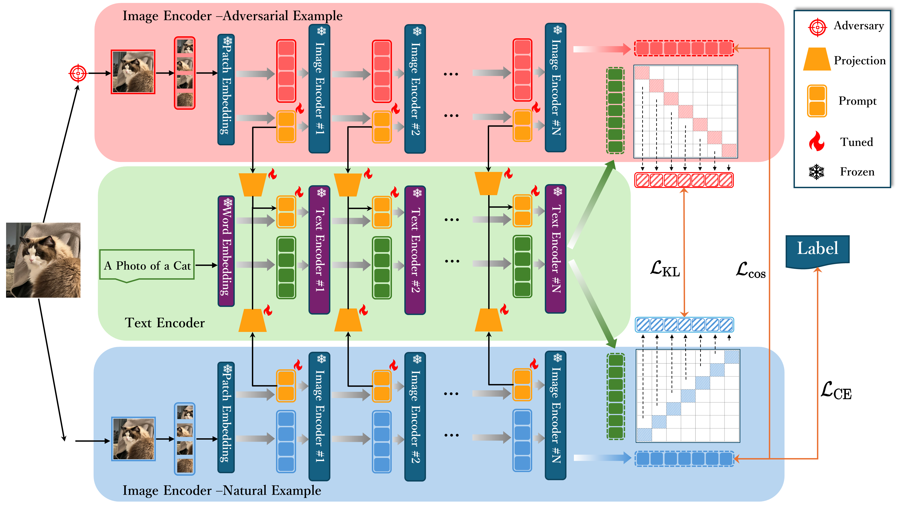

# 🌟 (NeurIPS 2024) Few-Shot Adversarial Prompt Learning on Vision-Language Models 

[YIwei Zhou](https://github.com/lionel-w2)$^1$, [Xiaobo Xia](https://xiaoboxia.github.io/)$^2$, [Zhiwei Lin](https://ac.bit.edu.cn/szdw/dsmd/sssds/znxxclykz/92d4c53eedf34a88897e80d4a86c873b.htm)\**$^1$, [Bo Han](https://bhanml.github.io/)$^3$, [Tongliang Liu](https://tongliang-liu.github.io/)\**$^2$ 

---

$^1$ School of Automation, Beijing Institute of Technology  
$^2$ Sydney AI Centre, University of Sydney  
$^3$ Department of Computer Science, Hong Kong Baptist University  

\*Corresponding authors

---


## 📝 Abstract
The vulnerability of deep neural networks to imperceptible adversarial perturbations has attracted widespread attention. Inspired by the success of vision-language foundation models, previous efforts achieved zero-shot adversarial robustness by aligning adversarial visual features with text supervision. However, in practice, they are still unsatisfactory due to several issues, including heavy adaptation cost, suboptimal text supervision, and uncontrolled natural generalization capacity. In this paper, to address these issues, we propose a few-shot adversarial prompt framework where adapting input sequences with limited data makes significant adversarial robustness improvement. Specifically, we achieve this by providing adversarially correlated text supervision that is end-to-end learned from adversarial examples. We also propose a novel training objective that enhances the consistency of multi-modal features while encouraging differentiated uni-modal features between natural and adversarial examples. The proposed framework gives access to learn adversarial text supervision, which provides superior cross-modal adversarial alignment and matches state-of-the-art zero-shot adversarial robustness with only 1% training data.

---

## 📷 Framework

<div style="text-align: center;">

**Figure 1: Our Few-shot Adversarial Prompt (FAP) Learning Framework**

</div>


---

## ⚙️ Setup

This work is built upon the **Dassl** framework and the code flow of **CoOp**, **CoCoop** and **MaPLe**. You can refer to instructions from [CoOp](https://github.com/KaiyangZhou/CoOp?tab=readme-ov-file#how-to-install) to set up the [Dassl](https://github.com/KaiyangZhou/Dassl.pytorch#installation) framework, prepare the [datasets](https://github.com/KaiyangZhou/CoOp/blob/main/DATASETS.md), and build the necessary requirements related to CLIP.

Please make sure you have installed the correct dependencies by following the installation steps provided in the CoOp and Dassl repositories.


## 🚀 Usage
We provide the following shell commands to run our FAP and other adversarial prompt learning methods. 

Before running, configure the `output_dir` and `data` path parameters in each shell script under the `scripts` folder to match your own output and dataset directories.


#### 1. Run FAP:

###### Few-shot adversarial prompt:
```bash
CUDA_VISIBLE_DEVICES=0 bash scripts/Adv/fap/few_shot.sh caltech101 16 0
```
This will sample training data in a few-shot manner for adversarial prompt learning of the model and evaluate the results on the test dataset.

###### Adversarial base-to-new generalization:
```bash
CUDA_VISIBLE_DEVICES=0 bash scripts/Adv/fap/base2new.sh caltech101 0
```
Conduct few-shot adversarial prompt learning using only half of the classes (base classes) to reflect the model's ability to learn the intrinsic features of the dataset.


###### Adversarial cross dataset generalization:
```bash
CUDA_VISIBLE_DEVICES=0 bash scripts/Adv/fap/cross_dataset.sh 0
```
Perform few-shot adversarial prompt learning on the ImageNet dataset and directly evaluate zero-shot robustness on 10 downstream datasets.

#### 2. Other adversarial prompt methods:

**Our code also supports the following methods:**

- **Adversarial Visual Prompt ([zsrobust](https://github.com/cvlab-columbia/ZSRobust4FoundationModel))**
- **Adversarial Multi-modal Prompt (AdvMaPLe)**
- **Adversarial Vision-Language Prompt (AdvVLP)**
- **Zero-shot CLIP (Advzsclip)**

You can check the corresponding Python files under the `trainers` scripts to see their implementation, or refer to the shell scripts in the `scripts` directory to run the experiments.

---


## 🙏 Acknowledgements

Our work acknowledges the contributions of [**Dassl**](https://github.com/KaiyangZhou/Dassl.pytorch), [**CoOp**](https://github.com/KaiyangZhou/CoOp), [**CoCoOp**](https://github.com/KaiyangZhou/CoOp), [**MaPLe**](https://github.com/muzairkhattak/multimodal-prompt-learning), and [**Zsrobust**](https://github.com/cvlab-columbia/ZSRobust4FoundationModel).


## 📚 Citation
If you use this code in your research, please cite the following:
```bibtex
@inproceedings{zhou2024fewshot,
  title={Few-Shot Adversarial Prompt Learning on Vision-Language Models},
  author={Yiwei Zhou and Xiaobo Xia and Zhiwei Lin and Bo Han and Tongliang Liu},
  booktitle={Proceedings of the 38th Conference on Neural Information Processing Systems (NeurIPS)},
  year={2024}
}
```